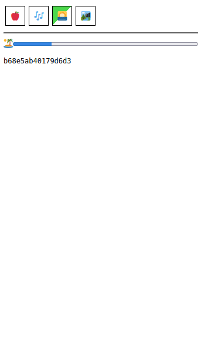

# trackl

Track tasks and events, in a tiny way.

**Status**: Extremely alpha, do not to eat.  Right now you'll need to use sqlite to add any tasks.

Inspired by https://loophabits.org/, only my own to tinker with.  Use that one if you want an actual task/habit tracker.

## Why?

To play around!  And maybe to try out some ideas like single-use tasks and a more conscious awareness of time passing by tracking that as well.

## Development

Build using `make` and/or use `git ls-files -co '*.go' | entr -c -r go run .` for more interactive development.

## License

This project is licensed under [AGPLv3](./LICENSE).
